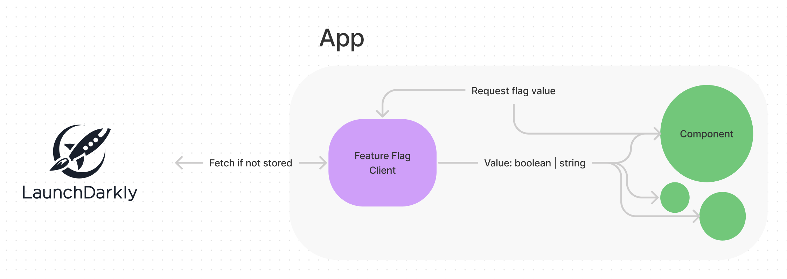

# Dev Assumptions

- Using the LaunchDarkly SDK, I created a Provider that can be wrapped around the flags to the entire 
  app. The `useGetFlagValue` hook can be used to get the flag value from the context.
- The flags state in the provider are set as the raw data and not exposed to the rest of the app.
  This is due to ensuring type-safety and only allowing valid flags to be called.
- Regarding Flag keys, there were a couple of interesting ways to handle this. I initially thought
  that validating the flags using Zod would be good, but I thought that if flags are added/removed
  from LaunchDarkly, then Zod parse would through errors, which is non ideal. For the flags to 
  be used in the code base, a key needs to be defined in `src/providers/LaunchDarkly/types.ts`
  and the `src/feature-flag-config.ts` (though it could be possible to merge these two files).
  This would allow for type-safety and ensure that the flag keys are valid. As flags are added
  into the code base to be used anyway, I thought this would be the best strategy allowing for
  narrow type-safety and relevant values.
- Tests were created for all LaunchDarkly Provider and hook and the components. screens were 
  not tested as they were not changed. (though obviously they needed tests before being merged)
- Needed to do a bit of test setup to ensure RTL worked as expected.

# **Getting Started**

### **Requirements**

- Git
- Node
- Yarn

### Install dependencies

`yarn`

### **Running the app**

`yarn start`

### **Running your tests**

`yarn test`

# Context

At Eucalyptus, we often release features into production multiple times a day. To do this iteratively & reliably, we enlist the help of **Feature flags** to have control over when, and how our features are released.

Here is some more information on the concept in case you're curious:

[https://launchdarkly.com/blog/what-are-feature-flags/](https://launchdarkly.com/blog/what-are-feature-flags/)

To leverage these feature flags, we often create a **Feature flag client.** This client acts as an interface between our feature flag provider (LaunchDarkly) and a customer application, written in React.

## Problem

We would like you to create a feature flag client, that would be used to provide feature flag values to a frontend application. Integrating with our provider LaunchDarkly, the client should be responsible for fetching, storing, and accessing these values in a React application.

We have provided a few things for you to get you started,

- A very basic frontend application for you to get started with, that contains a login screen & two application screens. Feel free to update the structure as you wish
- A LaunchDarkly project that is serving three feature flags. You can find the access key in the repository (as well as some details)
- Please use this Javascript SDK (launchdarkly-js-client-sdk dependency, not the React equivalent) to integrate with LaunchDarkly:[https://docs.launchdarkly.com/sdk/client-side/javascript](https://docs.launchdarkly.com/sdk/client-side/javascript)

### Requirements

- The application must have access to all feature flag values at all times.
- The application can fetch, store, and serve the **correct** flag values for a user.
- These components are rendered (differently) based on these flag values. We have left comments in these components with instructions
  - Page layout (launch banner)
  - Medication Details
  - Request review button
- A useful set of helpers to interact with these flag values.
- An event with relevant information is fired when a feature flag value is evaluated, i.e determines what to render. Don't worry about actually sending the event (a console.log is fine), but more so around the setup & logic to do so correctly. This event should contain information about the user & feature flag.

## Tips

We'll be looking for:

- A well-designed and extensible implementation.
- Production quality code.
- Useful and well-structured tests.
- Clearly communicated assumptions, and a description of any extensions you don't get time for.
- A functionally correct solution (we'll be running the solution & testing it against different flag configurations).
- Error scenarios considered
